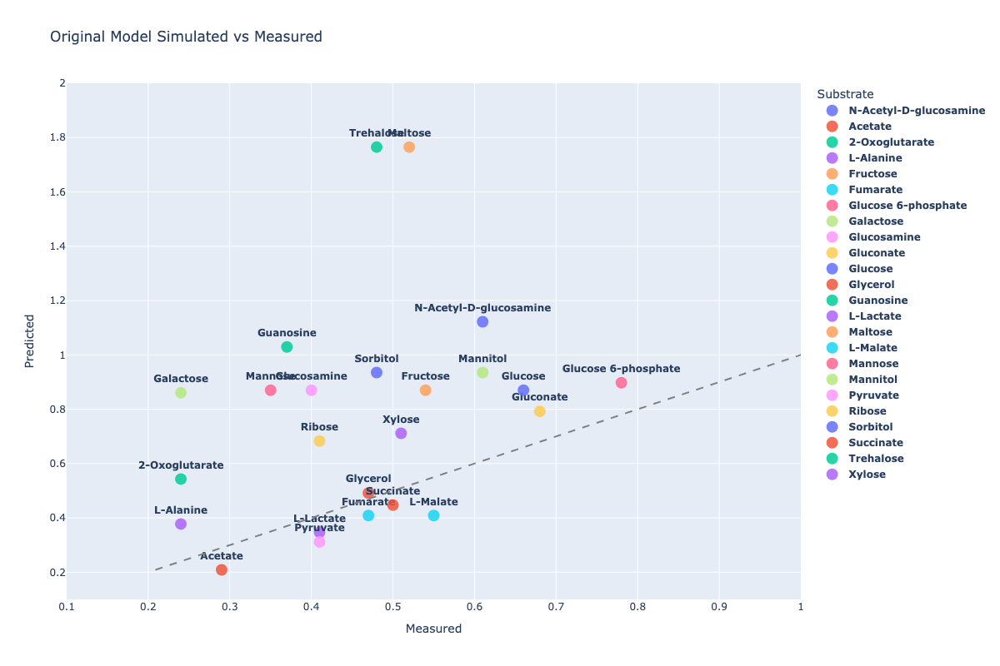
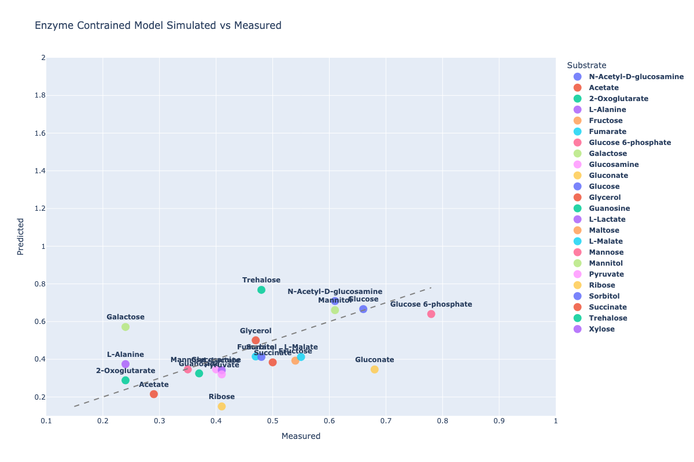
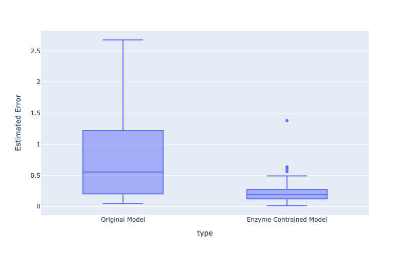

# BioPathOpt

BioPathOpt is a Python package designed to streamline metabolic engineering workflows by integrating advanced modeling and optimization tools into a unified framework. It enables researchers to enrich stoichiometric metabolic models with additional biochemical data, seamlessly incorporate enzyme-constrained modeling approaches, and perform targeted optimization for the production of desired molecules.

## Enzyme Constrained Modelling

Enzyme-constrained modelling extends traditional metabolic models by limiting reaction rates based on enzyme capacities. 
This adds biological realism, captures proteome allocation trade-offs, and improves prediction accuracy for metabolic engineering.
There are two different modelling frameworks for this type of modelling [GECKO](https://github.com/SysBioChalmers/GECKO) written in 
MATLAB and [ECMpy](https://github.com/tibbdc/ECMpy). The former is impractical if you do not have the right license and the later
is slow and has not been updated for a while. To this end, we provide this package to help the metabolic engineering community
run these types of models with more ease.

Below are plots that illustrate the improvements of this type of modelling framework to accurately simulate cell metabolism

|||
|:-:|:-:|
|Original iML1515 model predictions for various carbon sources|EC iML1515 model predictions for various carbon sources|

We see that there are clear improvements:



# Installing

Run the following code to install by travelling to the github folder and running:

```
pip install -e .
```

# Creating the cache

> [!IMPORTANT]
> You must manually download the brenda JSON on their website manually

The package parses the following databases: [MetaNetX](https://www.metanetx.org/) 
and [Brenda](https://www.brenda-enzymes.org/) and generates a large cache to
enrich models. The later needs to be downloaded
[here](https://www.brenda-enzymes.org/download.php) and compressed: 

```
from biopathopt.utils import write_compressed_json
import json
write_compressed_json(
    json.load(open('brenda_2024_1.json')), 
    'biopathopt/flatfiles/json_brenda.json.gz',
    )
```

To generate the cache run the following:

```
import biopathopt
data = biopathopt.Data()
data.refresh_cache()
```

# Notebooks

Here is a non-exhaustive list of the features of this package.

## Enrich model

The [Read model notebook](notebooks/read_model.ipynb) shows you how to pass any cobrapy model
and enrich the annotations automatically

## Enzyme constrained model

[Enzyme-constrained notebook](notebooks/build_enzyme_constrained_model.ipynb) shows you 
how to build an enzyme constrained model and using an E.Coli model demonstrates the 
improvements in this modelling method vs the classical model by comparing it to
actual measured data. (taken from [ECMpy](https://github.com/tibbdc/ECMpy))

## FSEOF Optimization 

The [FSEOF notebook]() (Flux Scanning based on Enforced Objective Flux) algorithm identifies 
metabolic reactions whose flux increases when production of a target compound is 
enforced, helping to pinpoint potential overexpression targets for strain engineering.

# Acknowledgements 

This package would not be possible without the work of [ECMpy](https://github.com/tibbdc/ECMpy) 
and [FVSEOF](https://github.com/LucasCoppens/fvseof/tree/main) where we I copied
and altered a lot of the code. This is built relying heavily on [CobraPy](https://github.com/opencobra/cobrapy).

# References

- Mao, Zhitao, et al. "ECMpy 2.0: A Python package for automated construction and analysis of enzyme-constrained models." Synthetic and systems biotechnology 9.3 (2024): 494-502.
- Ebrahim, Ali, et al. "COBRApy: constraints-based reconstruction and analysis for python." BMC systems biology 7.1 (2013): 74.
- Chen, Yu, et al. "Reconstruction, simulation and analysis of enzyme-constrained metabolic models using GECKO Toolbox 3.0." Nature protocols 19.3 (2024): 629-667.

